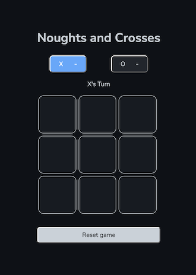

# Noughts and Crosses

by Daniel Nguyen, October 2021

Check it out the live version [here](https://the-daniel-nguyen.github.io/project0/)!



## 📖 Background

This was my first project in General Assembly's Software Engineering Immersive, completed during Week 3 of the 12-week course. It took me four days to write.

It combines everything we'd learnt so far about HTML, CSS, JavaScript and jQuery.

## 🎯 Project Brief

We had to create our own [Tic Tac Toe](https://en.wikipedia.org/wiki/Tic-tac-toe) game. I called it "*Noughts and Crosses*" to unAmericanise it.

See the full spec here: [Project-Brief.md](Project-Brief.md).

## 💡 Inspiration

I used [Google's version](https://g.co/kgs/ynZh3M) as the inspo for my game design.

(Their animations are better than mine 😢... for now!! )

## 🛠 How I approached the task

Having readable code is very important to me, so I separated my JS code into [`backend.js`](js/backend.js) and [`frontend.js`](js/frontend.js) files. And even all my CSS files are separated by component.

No DOM manipulation occurs in the backend, which also allows for future scalability to different frontend frameworks!

#### Documentation snippet:

Full documentation will come if I ever get around to it.

`backend.js`:
```JavaScript
const GAME = {
  // The backend database.
  // Contains everything needed to play the game, even in the console!
  // eg. board, settings, players, play(), result, reset()...
}
```

`frontend.js`:
```JavaScript
const RENDER = {
  // Contains all the methods for rendering HTML via jQuery
  // this.render() and this.resetBoard() call all the other RENDER methods
};

const HANDLERS = {
  // These are the only methods in the whole program that interact with both backend.js and frontend.js
  // These are called by methods in $(document).ready()
};

$(document).ready(function () {
  // Contains all event listeners
});
```

## 🙏 Coming soon

* Improved responsive design for mobile browsers 📱
* Funner styling – *I really hate styling* 🤮
* Customising player tokens
* [**LocalStorage**](https://www.firebase.com/) to persist data locally to allow games to continue after page refresh or loss of internet connectivity
* [**Google Firebase**](https://www.firebase.com/) for networked multiplayer
* Playing against AI ( Easy, Medium and Impossible ). I think I need to read about [game trees](https://en.wikipedia.org/wiki/Game_tree)

## 🍻 Thanks

Thanks to Joel, Rowena and Pat (the instructional team) for their quality Slack content, gifs and memes so far... and also the teaching, I guess.
